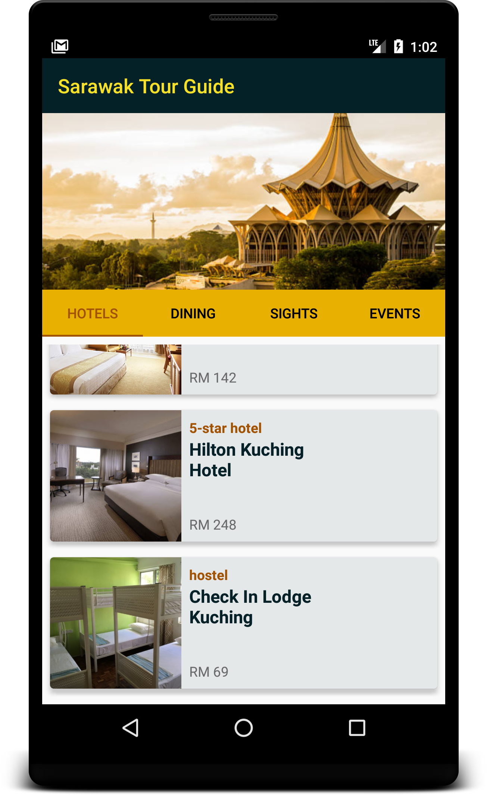
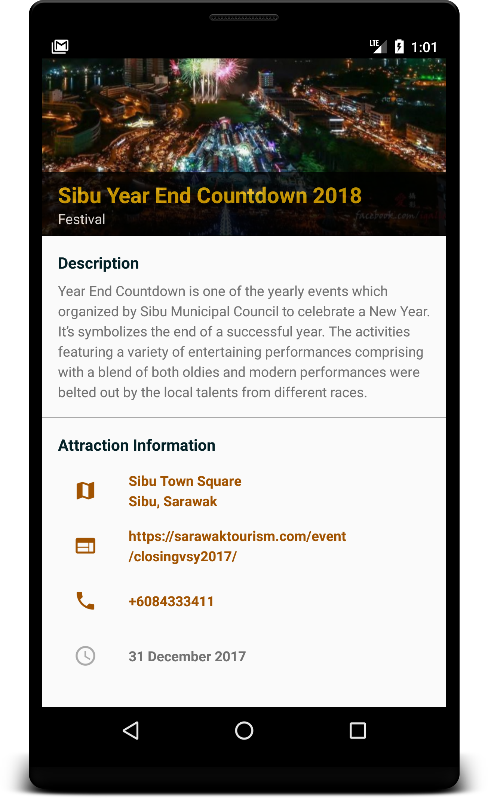

# Sarawak Tour Guide App

Tour guide app written for Udacity Android Basics by Google Nanodegree Program

## Project Background

The goal is to create a tour guide app which presents relevant information to a user who’s visiting my city. The app 
list top attractions, restaurants, hotels and events happening in the city. This is an app with multiple screens, each 
of which lists attraction and eventsin Sarawak, Malaysia. User can navigate between lists using View pager. Clicking each 
item in the list will lead to detail screen showing all the information regarding the item you clicked. Clicking on the 
highlighted attraction information (address, website, phone number) will open up external app (map app, web browser, phone 
app).

## Screenshots

